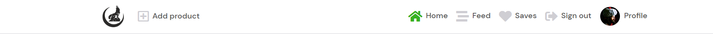

# Carplace

This site is for users who wants to buy or sell their cars. Users can posts their cars and try to sell it to other users or buy a car from other users. you can make a bid or leave a comment to a car.

for the live website click
[here](https://frontend-pp5.herokuapp.com/)

for the backend click
[here](https://github.com/MustafaSahinci/pp5-backend)

## 1. User Experience (UX)

Unregistered users can see the cars, profiles, comments and biddings. but can't place a post(car), comment or bid.

Registered users can create, read, update and delete their posts(cars), commments and biddings. They can follow their favorite sellers and only see their posts(cars) in feed. They can also save the posts(cars) which they interested in and find it easy later. The users can also edit their profile, username and password.

### First Time Visitor Goals
- as a first time visitor, I would like to see a clear home page
- As a first time visitor, I would like to easily navigate through the website.
- As a first time visitor, I would like to see the posts(cars)
- as a first time visitor, I would like to see the profile of the users.
- as a First Time visitor, I would like to register.

### Returning Visitor Goals
- As a returning visitor, I would like to login.
- As a returning visitor, I would like to save posts(cars). 
- As a returning visitor, I would like to comment on posts(cars).
- As a returning visitor, I would like to create, read, edit and delete my own comments.
- As a returning visitor, I would like to create, read, edit and delete my own posts (cars).
- As a returning visitor, I would like to create, read, edit and delete my own bid
- As a returning visitor, I would like to edit my own profile, username and password
- As a returning visitor, I would like to see al my own post(cars) in my profile page
- As a returning visitor, I would like to logout when I want.

## agile
Agile is an approach to project management that centers around incremental and iterative steps to completing projects. The incremental parts of a project are carried out in short-term development cycles

I used the Canban board in github projects and issues which you can see 
[here](https://github.com/users/MustafaSahinci/projects/1/views/1)

And I used the github Milestones for the sprints which you can see
[here](https://github.com/MustafaSahinci/pp5-frontend/milestones)

## Scope
For the scope of this project the following key points were determined.

- Create a webpage application using React.
- Use bootstrap to make the site responsive.
- Allow the user to create an account so that they can create their own post(cars) profile, comments and biddings.
- Allow logged in users add comments and biddings so they can communicate with each other
- Allow users to Crud(Create, Read, Update and Delete) their posts, comment, biddings and profile.
- The website should be easy to navigate and everything should be clear

## design

font-family: 'DM Sans', sans-serif

Colors:
I tried to keep the colors simple for a clear site. so I used mostly white, black and grey colors and my favorite color green 

Wireframes

 

wireframe for homepage

wireframe for carpage

wireframe for createpage

wireframe for profilepage

wireframe for sign in page

wireframe for sing up page

## Front End
### React
 

A React developer is responsible for the design and implementation of user interfaces (UIs) and UI components using React, a front-end JavaScript library. They develop and maintain UIs for web and mobile apps.

React is a declarative, efficient, and flexible JavaScript library for building user interfaces. Its primary goal is to make it easy to reason about an interface and its state at any point in time, by dividing the UI into a collection of independent and reusable components.

I used React for this application for several reasons:

- Speed - applying React significantly increases the page loading speed and reducing the wait, which affects user experience and satisfaction
- Flexibility - the React code is easier to maintain and is flexible due to its modular structure, compared to other front-end frameworks
- React Bootstrap - excellent choice for improving user experience, used for styling and responsiveness. It comes with ready-to-use React built components. They are implemented with accessibility in mind, which is a vital factor when creating a front-end application. I used plain Bootstrap in my previous projects, so it was an easy choice to use React Bootstrap in this app.
- Most used library for developing social networking and media content applications - e.g. Meta (formerly Facebook), Instagram, Netflix, Airbnb, etc.
- Reusability of components - no need to write various codes for the same features

There were various components created and reused across this application.

`<Asset.js />` - multipurpose reusable compontent which displays different versions of the component depending on the props we pass to it:

loading gif (spinner) when content is being loaded

image with src and alt attribute

paragraph with a message

`<Avatar.js />` - reusable component, used to render profile images in the UI. Passed props allow for setting image source and size and adjust image dimensions depending on where the component is rendered. Example of use include the `<NavBar.js />` component, Car page or the Profile page. On mobile screens Avatar component within the Profile Page will be significantly bigger than on other screen sizes.

`<BiddingModal.js>` component for displaying a modal on small screens with the biddings section in it.

`<Car.js>` component for displaying the Car card in the CarPage

`<Car2.js>` component for displaying the Car card in the ProductPage

`<MoreDropdown.js />` - reusable component, used to render the dropdown menu which allows user to edit or delete their own cars, biddings or comments, and also edit their profile or change profile password.

?<FeedbackMsg.js /> - component for displaying feedback messages to the user upon editing/deleting comments, deleting post, updating profile information or a password.?

`<NavBar.js />` - reusable component with the content depending on the login status of the user. For logged in user it shows icon link to the main posts(cars) page, add product link, home link, feed link, saves link, log out link and user avatar/picture(profile). For those who are not logged in, it shows a icon link to the main posts(cars) page and links to sign in or sign up. The component is used on each page of the app.

?<PageNotFound.js /> - specific component for displaying a 404 graphic error message with a return to menu button when user enters the url which does not exist.?

## Back End
### Django REST Framework
The API for this Front-End application was built with the Django REST Framework.

## 2. Features

Home page

 

user stories in Milestone The Products Page covered

The home page is kept simple. it consists of a navigation, search bar, the posts(cars) and the best sellers profiles.

In the search bar the user can filter on profile names and titles of the posts(cars)

The Car card on the home page is different from the card on the Carpage. This card doesn't have the content and Carousel of images, But only 1 image which you can click to go to the post(car)

This is the home page on a small screen. you have still all the features, only the follow button on the best sellers is not here.

Navigation

 

user stories in Milestone Navigation & Authentication covered

the navigation can be found at the top of the website. If you are not logged in, you will see home, sign in and sign up. If you are logged in, you will see add product, home, feed, saves, sign out and profile.

The navigation adapts to smaller screens by becoming a hamburger menu and is fixed on top so it's always easily available.

Registered users

Unregistered users

Responsive Navigation registered users

Responsive Navigation unregistered users

Responsive Navigation hamburger menu unregistered users

Responsive Navigation hamburger menu registered users

feed and save page

 

user stories in Milestone The Products Page covered

On the feed page you can see the posts(cars) of the sellers you are following. On the saves page you can see the posts(cars) you liked.

If you don't follow anyone you see a screen with:
No results found. Adjust the search keyword or follow a user.

If you don't have a post(car) saved you see a screen with:
No results found. Adjust the search keyword or save a post.

carpage

 

user stories in Milestone The Product Page covered

Here you can find the images, title, price, year, km and content of the post(car), as well as how many saves, comments and biddings the post has. Here you'll also see who the author is and the favorite sellers.

If you created this post(car), you will also see the three dots with links to edit and delete the post. You can see the comments and biddings below. If you are logged in, you can post your comments and biddings. You can also edit or delete your comments or biddings

You can change anything about your post(car) on the Car edit page. And you can delete your post(car)

Registered user

Unregistered user

responsive screen with the biddings modal(registered user)

responsive screen with the biddings modal(unregistered user)

The car edit page and responsive car edit page

profile

 

user stories in Milestone The Profile Page covered

On the profile page you see your profile image, username, how many cars you posted, hwo many followers you have, how mnay followings you have and the bio. Below are all the posts(cars) you created. If you click on the three dots on the right you can change you profile details, username or password. If you are on a profile from a different user you see the button to follow/unfollow this is for small screens the only place you can do this. 

other users profile 

your profile

your responsive profile

other users responsive profile

edit profile page

change username page

change password page

responsive edit profile page

responsive change username page

responsive change password page

Create car

 

user stories in Milestone Adding & saving products covered

Here you can create a car and it is responsive. you can add 4 pictures, title, price,year, km and content 

Create product page

Responsive create product page

favorite sellers

 

user stories in Milestone The Products Page covered

Here you see the favorite sellers component. You can follow a user and the can follow you!

registered user

unregistered user

responsive

sign in and up

 

user stories in Milestone Navigation & Authentication covered

Here you can sign in and look at the nice image!

here you can sign up and look at the nice image!

 

### future features
- chat page between the user's in place of comments
- Users can login with their social media accounts
- categories for bike's, clothing and many more
- new design
- highest bid always up

## 3. Technologies used
- HTML5 used for markup
- CSS3 used for style
- JavaScript
- react Used for building components that collectively form the front end of the application.
- React-Bootstrap Used for styling the site.
- ElephantSQL Used as database for this project
- Ludichart Used to create the site map.
- amiresponsive Used to see how responsive the site is on different devices. 
- Cloudinary used to storing images and static files.
- Django used to build the backend database, that serves as an API for the front end part of the project
- Font Awesome used for icons
- Git used for version control, using the terminal to commit - to Git and Push to GitHub
- GitHub is used to store the projects code after being pushed from Git.
- Gitpod to write my code.
- Google Chrome Dev tools used for debugging.
- Google Lighthouse is used for audits to measure the quality of web pages.
- Heroku used to deploy this app.
- Favicon used for making the site favicon

## 4. Testing
Manual testing occurred regularly throughout local development and this project has been tested manually after deployment on Heroku 

- All form validations are working.
- you can't put letters in the bid form
- if you are not authorized to be on one of the pages like edit car from other users you get redirected to the home page. 

examples are:
- if you aren't logged in and you go to the link to create a post(car) you get redirected to the home page
- if you are logged in but go to the link for editing a post(car) from another user you get redirected to the home page

All the links, buttons and features are working
for login this error shows up:
- This field may not be blank.
- Must include "username" and "password".
- Unable to log in with provided credentials.

and for the register you can see these errors:
- This field may not be blank.
- This password is too short. It must contain at least 8 characters.
- This password is too common.
- This password is entirely numeric.

Tests

 

If you are nog loggedin you can still click on the posts(car) and see the product, favorite sellers, comments and biddings. but you can't see the form of comments or biddings. You can't see the follow button on the favorite sellers component either.

When you click on signin on the navigation you get to the sign in page. And these are the errors you can get if you don't fill in the form with the right information

When you click on signup on the navigation you get to the sign up page. And these are the errors you can get if you don't fill in the form with the right information

## 5.Bugs
- On the Carpage users can place a bid. To focus here on CRUD I wanted that the users can place only 1 bid, Because if the users can place more bids they don't need to edit or delete their other bids. To create this I needed a ternary operator, so when they place a bid the BiddingCreate form must disappear but when they delete their bid the BiddingCreate form must appear again. After researching on internet(google, stackoverflow), asking on slack it's was still not fixed. But with the help of the code institute tutors we finally where able to fix this problem with adding this code and this ternary operator in Carpage.js: 

- const checkUsername = obj => obj.owner === currentUser.username;
- currentUser && !biddings?.results.some(checkUsername) ?  

## 6. deployments
### Forking the GitHub Repository
1. Go to the GitHub repository
2. Click on Fork button in top right corner
3. You will then have a copy of the repository in your own GitHub account.

### Making a Local Clone
1. Go to the GitHub repository
2. Locate the Code button above the list of files and click it
3. Highlight the "HTTPS" button to clone with HTTPS and copy the link
4. Open commandline interface on your computer
5. Change the current working directory to the one where you want the cloned directory
6. Type git clone and paste the URL from the clipboard

- git clone https://github.com/MustafaSahinci/pp5-frontend.git

7. Press Enter to create your local clone

### Deployment

This project was created on GitHub and Edited in GitPod by carrying out the following:

- A new repository was created
- A meaningful name was given to the new repository and 'Create Repository' was selected
- The repository was then opened on GitHub by clicking - - the 'Gitpod' button to build the GitPod workspace which would allow me to build and edit the code used to make the PROJECT NAME HERE website/application
- Version control was used throughout the project using the following commands in the terminal using Bash
git add . OR git add "file name" - to stage the changes and get them ready for being committed to the local repo.
- git commit -m "Description of the update" - to save the change and commit the change to the local repo
- git push - to push all committed changes to the GitHub repo associated with the GitPod workspace

This project was deployed via Heroku by carrying out the following:

- Create the gitpod repo from the template via the gitpod button in github.
- Log in to Heroku and create a new app.
- Add the heroku-postgres add-on
- Complete the config vars section
- Link Heroku and GitHub accounts together
- Select the repo (via Heroku) that you want to make an app of and give it a name in Heroku.
- Click on deploy.

## 7. Credits
- Moments project from Code Institute
- My mentor Rohit Sharma
- Code institute slack community
- Stackoverflow
- React-Bootstrap documentation

### media
- images from google